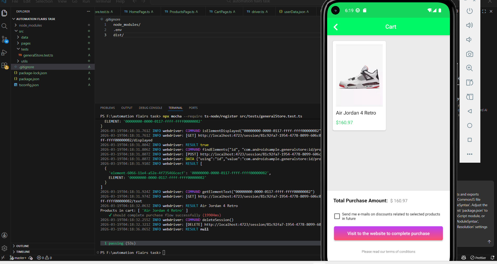

# Mobile Automation - General Store App

## Overview
This project is part of an Automation QC Engineer assessment.

The goal is to automate the main user flow of the General Store mobile application using Appium and TypeScript.

## Test Scenario
The automated test covers:
- Selecting country (Andorra)
- Entering user name
- Selecting gender
- Clicking "Let's Shop"
- Adding a product to the cart
- Opening the cart screen
- Verifying that the product is displayed

## Tech Stack
- Appium
- WebdriverIO
- TypeScript
- Mocha

## Project Structure
- `pages/` → Page Object Model classes
- `tests/` → Test cases
- `data/` → Test data
- `utils/` → Driver setup

## How to Run

appium 

npx mocha --require ts-node/register src/tests/generalStore.test.ts

## Screenshot

